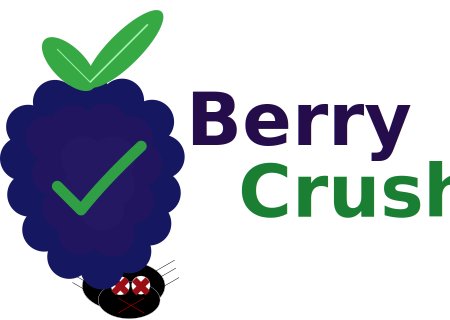

<p align="center">
  
</p>

<h1 align="center">BerryCrush</h1>

<p align="center">
  <strong>BDD-style API testing framework for Java/Kotlin with OpenAPI integration</strong>
</p>

<p align="center">
  <em>Write human-readable tests. Validate against your API spec. Automate everything.</em>
</p>

---

## What is BerryCrush?

BerryCrush is a **Behavior-Driven Development (BDD)** testing framework that bridges the gap between your OpenAPI specifications and your test suites. Write tests in plain English, and let BerryCrush handle the rest.

```
scenario: Create and verify a new pet
  when I create a pet
    call ^createPet
      body: {"name": "Fluffy", "status": "available"}
  then the pet is created
    assert status 201
    extract petId: $.id
  
  when I retrieve the pet
    call ^getPetById
      petId: {{petId}}
  then I see the pet details
    assert $.name equals "Fluffy"
```

### Key Features

- 🎯 **OpenAPI-Driven** – Validate requests and responses against your API spec
- ✨ **Human-Readable** – Write tests using Given/When/Then syntax
- 🔄 **Auto-Generated Tests** – Generate invalid request and security tests automatically
- 🧪 **JUnit 5 Native** – Run scenarios as JUnit tests with full IDE support
- 🌱 **Spring Boot Ready** – Seamless integration with Spring Boot applications
- 🔌 **Extensible** – Custom steps, plugins, and reporting

## Repositories

| Repository | Description |
|------------|-------------|
| [**berrycrush**](https://github.com/berrycrush/berrycrush) | Core library with JUnit 5 and Spring Boot integration |
| [**berrycrush-vscode**](https://github.com/BerryCrush/berrycrush-vscode) | VS Code extension for `.scenario` and `.fragment` files |

## Getting Started

### 1. Add Dependency

```kotlin
// build.gradle.kts
dependencies {
    testImplementation("org.berrycrush:berrycrush-junit:1.0.0")
}
```

### 2. Create a Scenario

```
# src/test/resources/scenarios/pets.scenario

scenario: List all pets
  when I request all pets
    call ^listPets
  then I get a successful response
    assert status 200
```

### 3. Run as JUnit Test

```kotlin
@BerryCrushScenarios("scenarios/pets.scenario")
@OpenApiSpec("petstore.yaml")
class PetApiTest
```

## Community

- 📖 [Documentation](https://github.com/berrycrush/berrycrush/tree/main/developer)
- 🐛 [Issues](https://github.com/berrycrush/berrycrush/issues)
- 💬 [Discussions](https://github.com/berrycrush/berrycrush/discussions)

## License

BerryCrush is open source software licensed under the [Apache License 2.0](https://github.com/berrycrush/berrycrush/blob/main/LICENSE).
